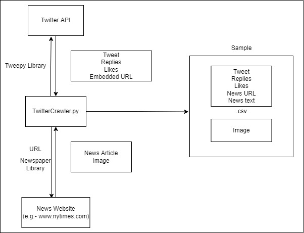

Affective Feedback Synthesis Towards Multimodal Text and Image Data
================================================

Implementation for the paper (submitted to ACM Transactions on Multimedia Computing, Communications, and Applications).  
**[Affective Feedback Synthesis Towards Multimodal Text and Image Data][1]** 
[Puneet Kumar](https://puneet-kr.github.io/), [Gaurav Bhatt](http://deeplearn-ai.com/), Omkar Ingle, Daksh Goyal and [Balasubramanian Raman](http://faculty.iitr.ac.in/~balarfma/)  

## Code Files
The code files are currently private as the corresponding research paper in ACM ToMM Journal is under review. They will be made publically available soon after the paper is published/accepted for publication.

Dataset Details & Access
-------------------------
The [`IIT Roorkee Multimodal Feedback (IIT-R MMFeed) Dataset`][2] dataset' has been compiled by Puneet Kumar, Omkar Ingle, Daksh Goyal and Gaurav Bhatt at Machine Intelligence Lab, IIT Roorkee under the supervision of Prof. Balasubramanian Raman. It consists of 9,479 samples containing news text, images, user comments, and the number of likes for each comment. The process to crawl the data from Twitter feeds is depicted in the following diagram:
<!---->

Access to the IIT-R MMFeed dataset can be obtained by through [`Access Form - IIT-R MMFeed Dataset.pdf`][2].   

[1]: https://dl.acm.org/journal/tomm
[2]:https://github.com/MIntelligence-Group/MMFeed/blob/main/Access%20Form%20-%20IIT-R%20MMFeed%20Dataset.pdf
